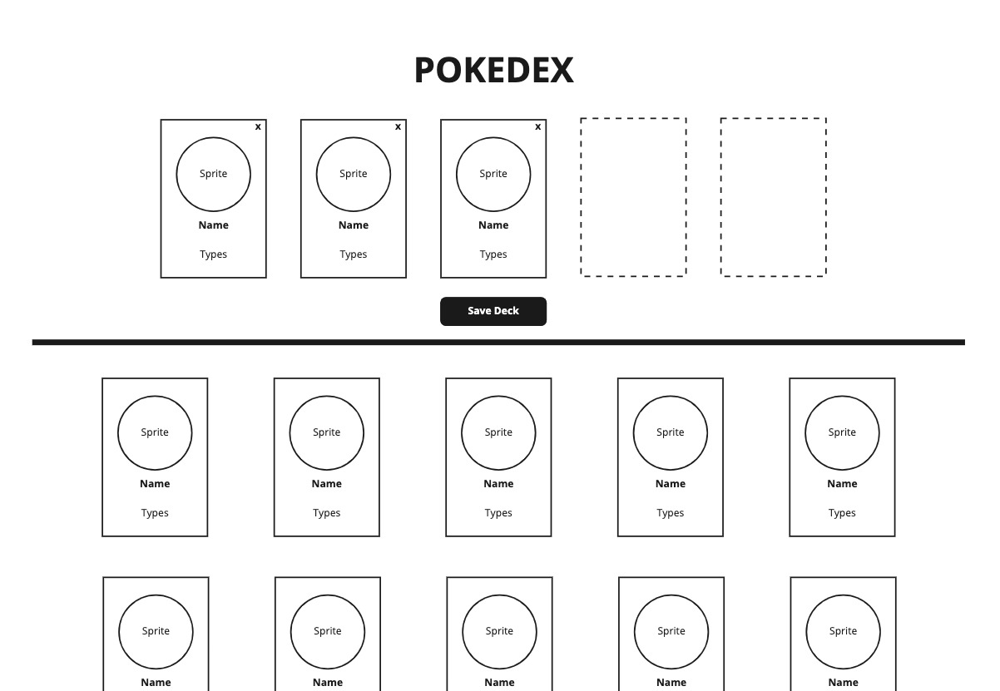

# Take-home challenge

## Step 1 - Handling the data
> 💡 We’d like for this challenge to take roughly 3-4 hours **at most**. To simplify the setup of this challenge, we’ve provided an example of response in a [file titled pokemon.json](./src/pokemon.json).


Take the JSON response provided in `pokemon.json` and create a service that can respond with  the values in the following structure:

```json
const pokemonArray = [
{
  id: 1,
  name: "Bulbasaur",
  types: ["grass"],
  sprite: "https://pokemon.com/pictures/bulbasaur.png"
}, {
  id: 2,
  ...
}, ...]
```

>
> 💡 Feel free to use any of the `sprite` values from the JSON response, but be consistent.
>

**Considerations:**

- Unit tests are not needed

---

## Step 2 - UI: Building a deck

Build a web-based application with the collected Pokémon data from Step 1.

> 💡 Bonus points if your elements are accessible.

### Part 1

Create a reusable `PokemonCard` component that takes in a pokemon object as a property and renders a card with the `name`, `id`, a list of `types`, and the `sprite` image. This card should be selectable by the user for addition and removal to their current`PokemonDeck` (see Part 3).

### Part 2

Use the `pokemonArray` create a `PokedexGrid` component that takes in the data and renders all of the `PokemonCard` components.

### Part 3

Create a `PokemonDeck` component that can display up to 5 selected `PokemonCard` components in a row (see the wireframes). The user should be able to “save” the deck for future use. Local storage is acceptable here.



**Considerations:**

- No need to save your decks beyond a user session (this will considered as be part of the design doc in Step 3)
- Unit tests are not needed

---

## Step 3 - Documentation and System Design

Write a design doc (about one page of text and up to two pages with diagrams) on how you’d architect a product around what you’ve already built in Steps 1 & 2.

**Audience:**

- Leadership (assume slightly technical, but needs some context/guidance)

**Requirements:**

- We need to build a CRUD service that can add, update, and delete Pokémon cards
- User can build several decks, up to 10 total, each with up to 5 cards
- User needs to be able to save the deck for future use beyond the current session
- User needs a way to toggle between decks

**Other** **Considerations**:

- Our app is web and mobile browser based
- We hope to scale this application to 100 million daily active users
- We need a place to host images
- We want metrics on how users are using our product
